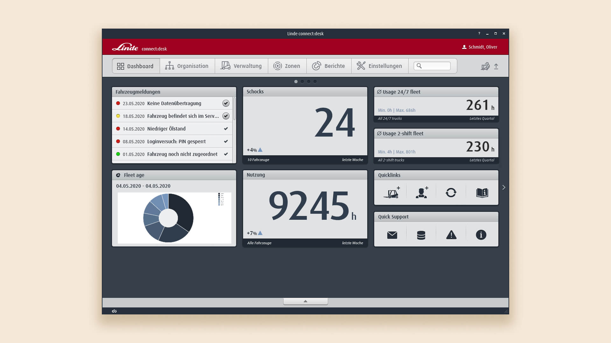
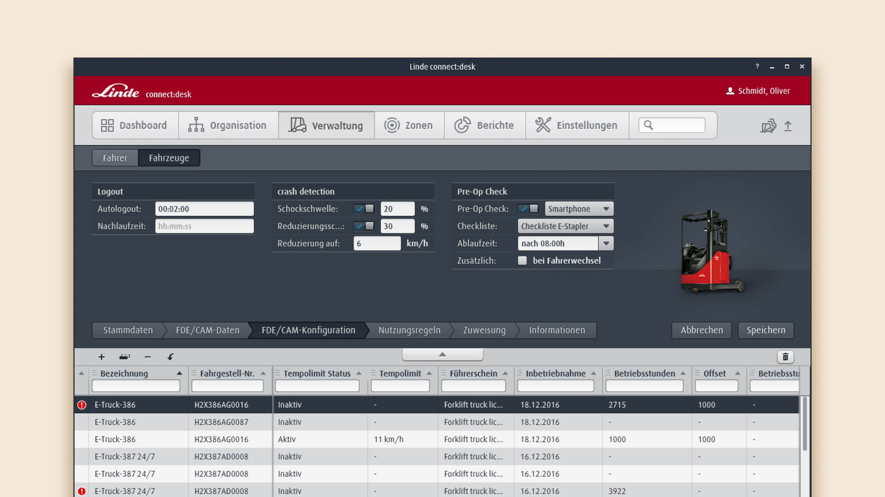
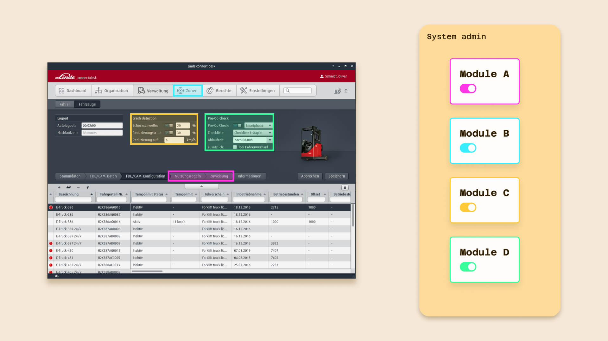
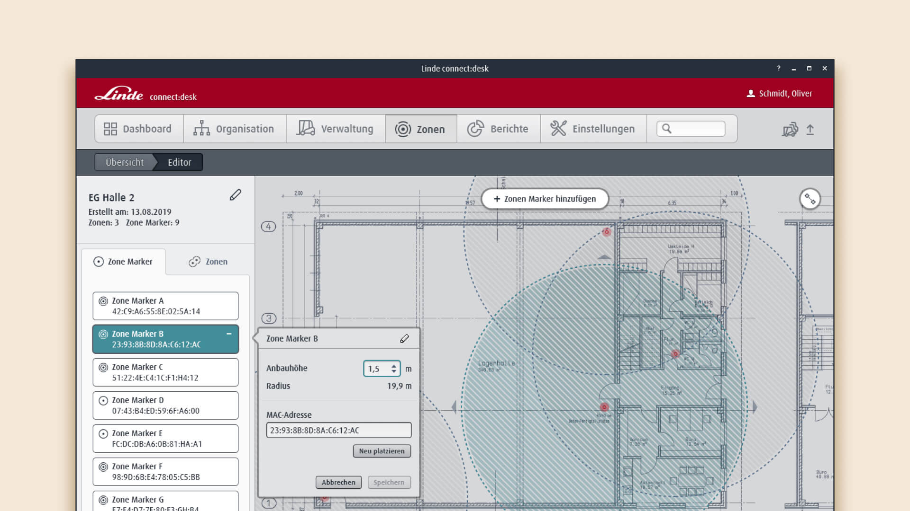
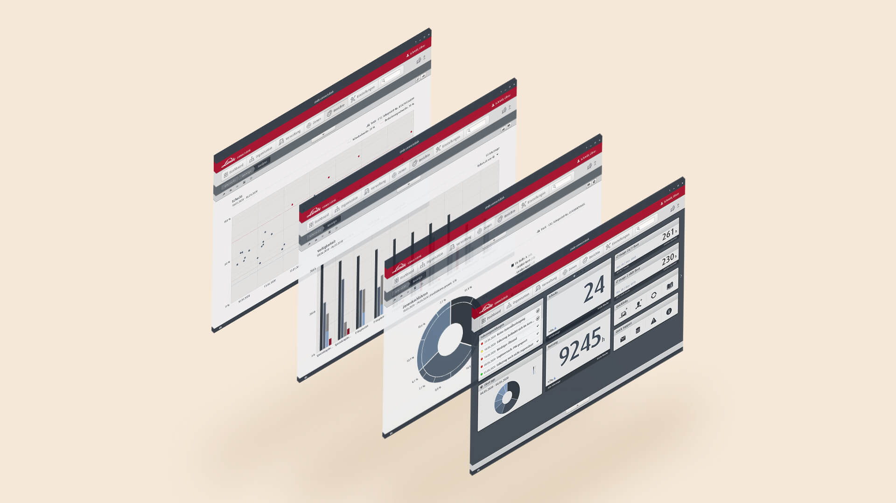

## About connect:desk

Linde Material Handling GmbH, a leading industrial truck manufacturer, offers
_connect:desk_ as a complementing software tool. It provides an overview in
managing and analyzing data from connected industrial trucks. This enables
features like accident detection, usage data and further detailed reports on
vehicle performance.

_connect:desk provides an overview in managing and analyzing data from connected industrial trucks with features such as the dashboard_

## Challenges and contribution

Initially intended as an integrated system with a specific, limited use case
in mind, connect:desk experienced feature bloat over time. New features and
reports were necessary due to emerging technologies such as electric engines
or fuel cell forklifts. However, customers spanning from small warehouses to
large international organisations had different requirements. Therefore a
rigid software led to a cluttered UI with unnecessary complexity and
performance issues.

I worked alongside a multidisciplinary team (with 4 designers, 5 developers,
a product owner and a technical translator) to enhance the software's
usability and functionality.

Our design team tackled this by:

- Conceptualizing new modularization features
- Updating the UI
- Evolving and optimizing the design system

_Feature bloat led to a cluttered UI, causing issues due to insufficient space for new features and reports_

## Modularizing the software

As the software evolved, modularization became a key feature, enabling users
to pick specific functions based on their individual needs. This approach
improved usability by reducing UI clutter and tailoring the platform to
client-specific requirements.

Implementing modularization required careful planning to map out
cross-dependencies, ensuring that changes in one module did not negatively
affect others. Users could manage these modules through their account
settings, but since this was also a process with sensitive dependencies,
access was restricted by an additional permission system to prevent
unauthorized adjustments.

The development of this approach also involved close collaboration with the
development team. It was crucial to update the component library regularly and
maintain system stability across the platform, ensuring that new or modified
features integrated seamlessly with existing ones.

_Modularization enabled toggling features, ensuring usability and stability through careful dependency and permissions mapping_

## Introducing zone control

A huge addition to the software was the introduction of the zone control
feature. Physical transmitters are placed in the warehouse allowing users to
define specific geo-fences where automatic rules like speed regulations could
be applied to vehicles.

This feature required new UI elements, such as draggable radii for adjusting
zone sizes and map navigation tools. After several briefings with the
engineering team, we designed these elements, drawing inspiration from map
tools like OpenStreetMap and canvas-based tools like Illustrator and Sketch.
We created a concept where users could place anchors on the UI, representing
the transmitters in the warehouse. These anchors can be grouped to apply rules
such as speed limits or lift height restrictions.

Challenges arose due to different input methods and workflow integration. The
internal engineering tool allowed quick, flexible changes. In contrast,
connect:desk required a more rigid approach, with inputs validated in an
editing mask before saving. It is necessary to consider that setting up
anchors in the warehouse and mapping them in the UI is sensitive work,
typically done by service technicians. Also, rules mostly stay unchanged, thus
an additional control layer prevents modifications by accident. Our focus with
this concept was on balancing flexibility with reliability, making sure the UI
was both intuitive and secure for various user needs.

_The feature required new UI elements, such as draggable radii for adjusting zone sizes and map navigation tools_

## Modernizing UI and component library

As part of the connect:desk redesign, our team focused on modernizing the UI,
originally released in 2012 when skeuomorphism was still broadly represented.
With stacking features and newly introduced UI elements, we faced performance
issues, especially for clients managing larger fleets. To tackle this, we
streamlined our component library, collaborating closely with the development
team to ensure all updates aligned with evolving design requirements.

We explored several design variants, from minimal tweaks to more radical
facelifts. Ultimately, we chose a minimal approach, retaining the existing
information architecture and focusing on interchangeable icons and subtle
color adjustments, especially given the constraints of JavaFX. Key UI elements
like buttons, input fields, and the app frame were updated, leading to better
performance, particularly through modularization.

Removing skeuomorphism and transitioning to a cleaner, more modern design
required us to adjust the component library which followed
[Brad Frost's Atomic Design methodology](https://atomicdesign.bradfrost.com/chapter-2/).
During the process, we encountered challenges such as naming conventions,
which were resolved through close collaboration with developers, aligning
mental models and ensuring consistency in the final components. Clear
communication with the development team ensured smooth implementation
throughout the process.

_The facelift removed skeuomorphic patterns and transitioned to a cleaner, more modern design_

## Outcome

connect:desk shipped as a modular product: customers now enable the functions
according to their needs and requirements. We had no measured baseline to compare
against, but the feedback from customers and from our the service teams was
consistent. The software felt noticeably faster, especially for the large
fleets that had suffered most from the clutter.

Zone control, battery management and driver reports went live as new features,
and the component library came out of the project in a state where the next
feature could be built from existing parts instead of new ones.

## Lessons learned

Being part of a skilled design team with well-established processes allowed me
to learn collaboration in a multidisciplinary team. Over time, we developed best practices, which were made easier
through methods like Photoshop scripts. The experience highlighted the
importance of collaboration and keeping a flexible design system, grounded in
Brad Frost's atomic design, to manage scalability and changes during the
product life cycle.

## Shoutout

Thanks to the design team at stellar design und engineering GmbH, who challenged me daily
to push my design skills to their boundaries and expand my knowledge of the
tools for this client project.
