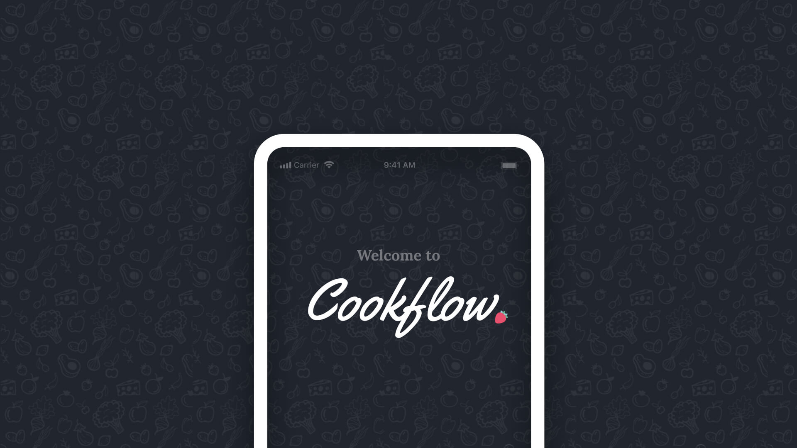
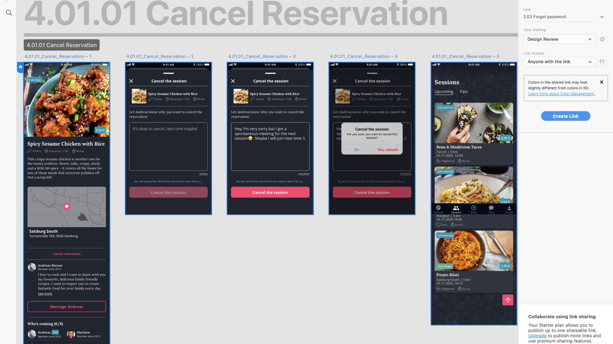
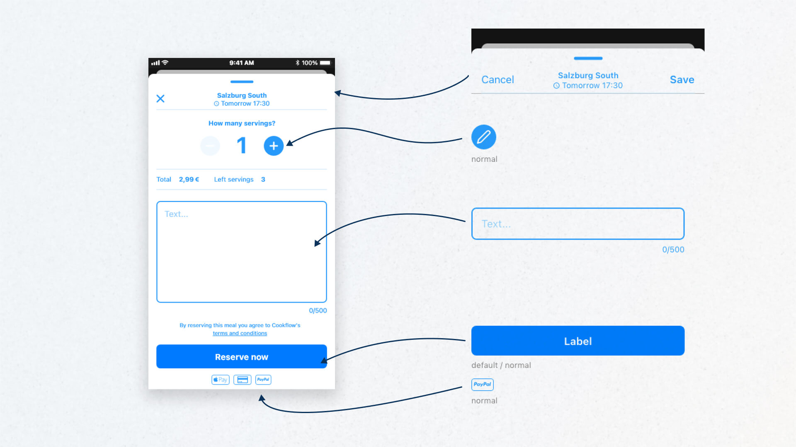
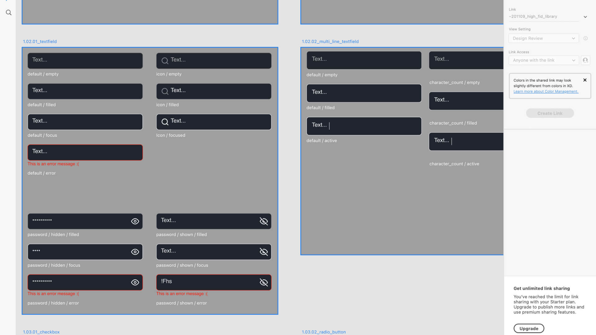
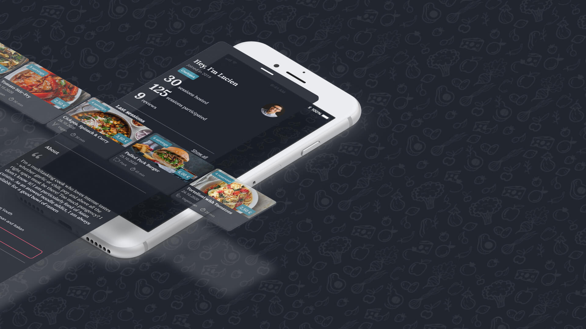
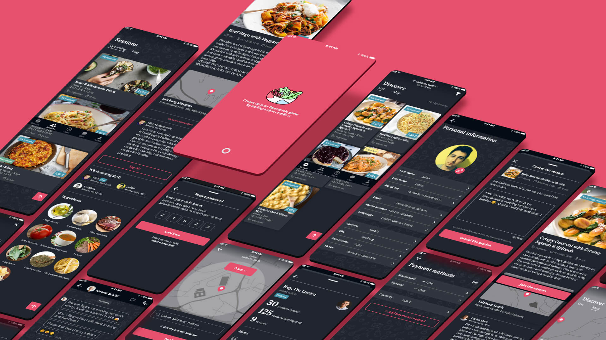

## About Cookflow

The aim of this project was to design a borrowing and renting app concept and
build a component library from scratch. I envisioned a platform where users
could host cooking sessions, splitting the cost of ingredients to fight food
waste. This concept, named *Cookflow*, went beyond just feeding people — it
also introduced them to new recipes and cooking techniques.

*Cookflow is an app concept designed to host cooking sessions*

## Deliverables

To conceptualize and visualize the concept, there were several key
deliverables:

- **Flow map:** Provide a high-level overview of the entire app outlining the
  main features.
- **Low-fidelity prototype:** Basic designs focusing on structure, offering an
  idea of the interface.
- **Interactive high-fidelity prototype:** A vertical prototype expanding on
  the main features, showcasing full functionality in a detailed, visually
  polished design.

*The vertical prototype showcases the main features in a detailed, visually polished design*

## Low-fidelity wireframes and component library setup

During the stage of low-fidelity prototyping, I decided to create a component
library using Adobe XD's linked file system. This approach allowed for quick
updates to core UI elements across different screens and design files. The
atomic design methodology from
[Brad Frost](https://atomicdesign.bradfrost.com/chapter-2/) was applied, which
helped break down the UI into small, reusable components and assets, ensuring
consistency across the design.

Building a modular system is time-saving when there is a plentiful amount of
repetitive elements and screens involved. However, depending on the fidelity
it also brought challenges, especially in the beginning when the speed of
developing variations was affected.

*Creating a reusable component library early introduced challenges in composition, slowing down design variations*

## Transition to high-fidelity wireframes

With the basic structure in place, I moved to high-fidelity wireframes,
refining visual elements like font sizes, color schemes, and hierarchy. Using
nested components ensured consistent assets across screens to systematize
properties like padding and margins.

While nested components streamlined iterations, they introduced complexity and
performance issues, slowing the design process due to increased file size and
layer count. The layered structure of these components ultimately slowed down
the design process, revealing the trade-off between flexibility and
efficiency.

*The layered structure of components increased file size and slowed down the design process*

In refining the design language, I embraced the challenge of aligning the
visual hierarchy to create a cohesive and harmonious experience. This involved
carefully determining suitable font sizes and establishing a unified color
palette. As the process unfolded, I gained deeper insights into how various
elements — such as list items, cards, and overlays — interact visually. These
learnings guided iterative adjustments, allowing me to fine-tune the design
and achieve a well-balanced and polished outcome.

To address this, I drew inspiration from
[Google Material Design](https://m2.material.io/design/environment/elevation.html#elevation-in-material-design),
creating a system that used z-index elevation levels paired with a fine-tuned
color gradient to better reflect layer hierarchy.

*Misaligned hierarchies were resolved by implementing an elevation system inspired by Google Material Design, using z-index levels and gradient adjustments*

## Outcome

This project taught me valuable lessons about the importance of structured
design processes. Setting up a design system from scratch, while
time-consuming, proved to be extremely beneficial during later stages of the
project. Despite technical challenges with Adobe XD, the modular system I
created retrospectively allowed for flexibility and scalability, laying the
methodical groundwork for future design projects.

*The modular system allowed for flexibility and scalability across different screens*

## Lessons learned

Coming from a background in Photoshop for UI design (yes, that was a thing if
you design for fixed hardware display layouts), this required a shift in my
design approach:

- Avoid early complexity in component composition in order to focus on
  variations in design exploration.
- Setting up a solid foundation for font sizes and color schemes early in the
  process is important to transition from low-fidelity to high-fidelity
  screens.
