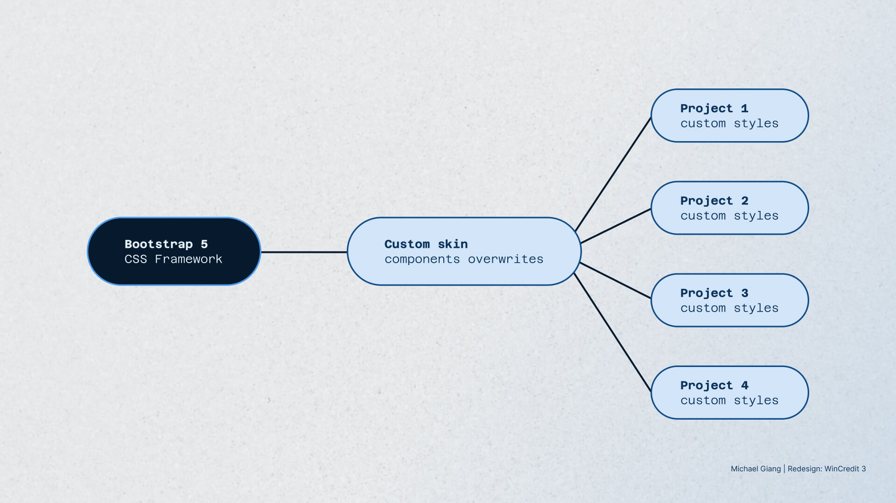
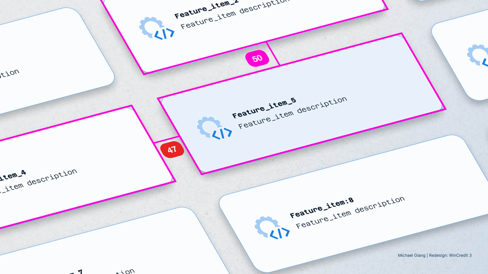
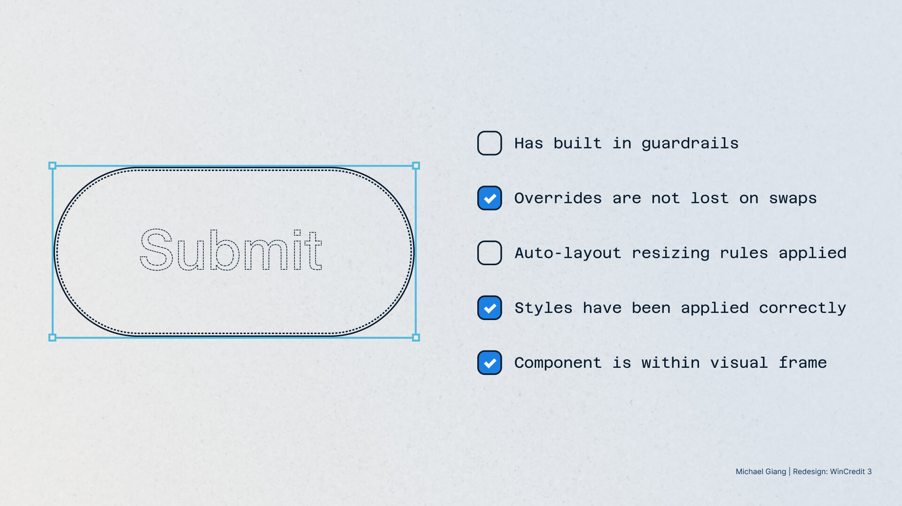
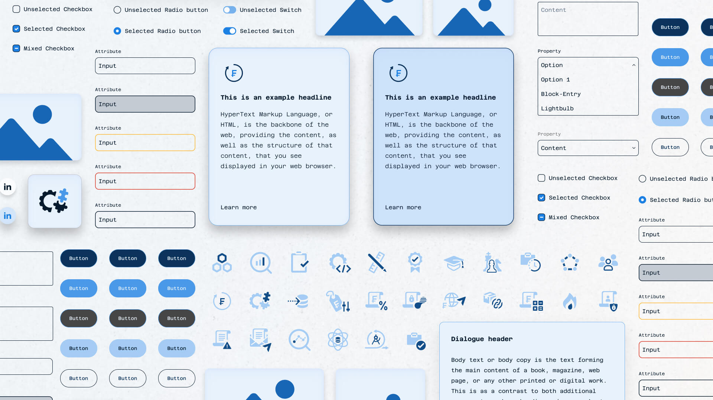
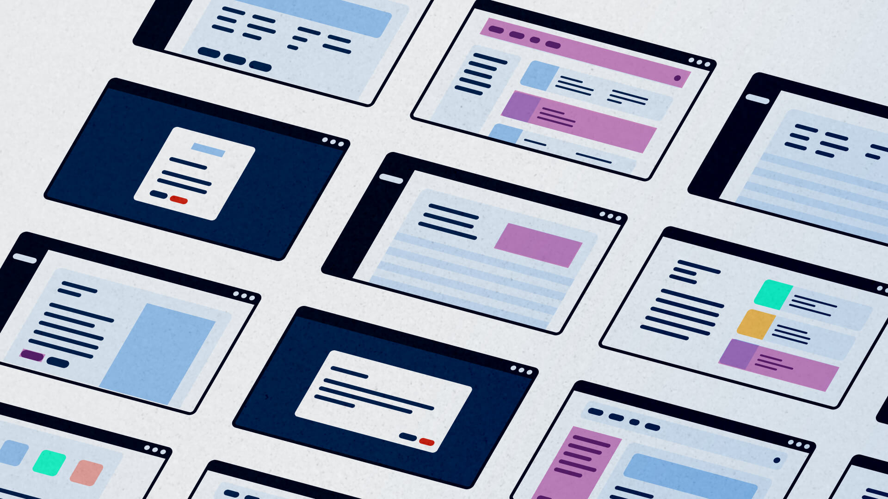
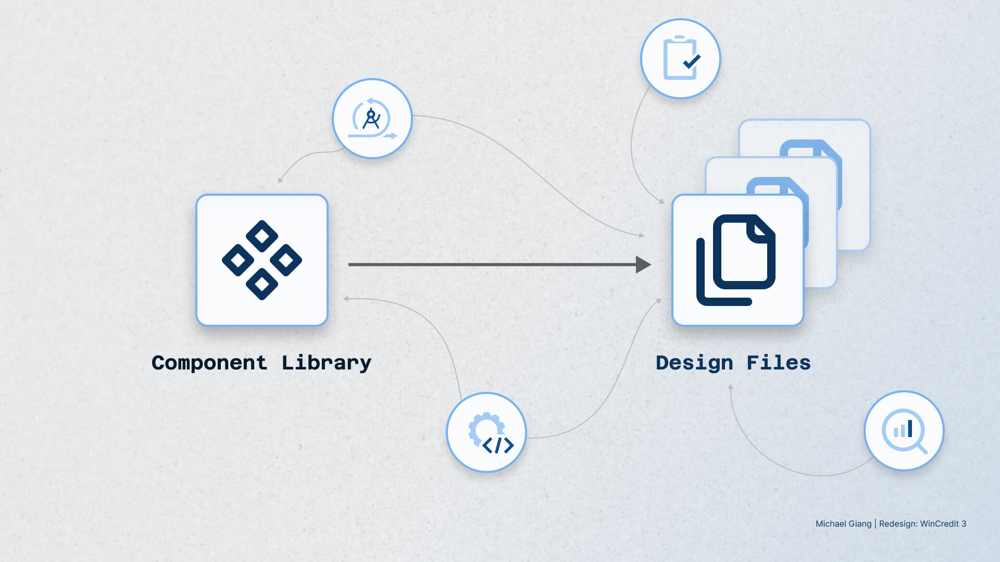

## Project context

As part of the *WinCredit 3* project, our design team migrated the component
library from Adobe XD to Figma. The goal was to establish a scalable and
efficient design system that could support not only *WinCredit 3* but also
other company products. This system became a central source of truth,
accessible to designers and stakeholders for assets, patterns and code
components.

There was a central design language, but individual child themes were derived
depending on the project. These individual themes mostly affected color,
fonts, spacing, assets or border radiuses. Since every product had Bootstrap 5
as foundational framework, this would also streamline processes within the
design team.

*There was a central design language, but individual child themes were derived depending on the project*

## Problem statement

Before the project began, Adobe XD was the main tool to design components, but
it had become outdated in recent years. Tasks like creating high-fidelity
screens became increasingly tedious as projects grew in complexity.

The other two designers had primarily been focused on cross-functional work
and developing new features, which left less time for maintaining the
components. This contributed to some inconsistencies across the designs.

Although an initial cost-benefit analysis suggested that migrating to Figma
might not be essential, growing design requirements, new functionality, and
the launch of WinCredit 3 made the transition viable.

*Growing design requirements contributed to some inconsistencies*

## My responsibilities

- Conduct a visual audit
- Component library migration
- Standardized design library for cross-project consistency
- Continuous optimization of components and screen design process
- Stakeholder education

## Conduct a visual audit

To maintain design integrity, I conducted a visual audit of the existing
assets and components to gain an understanding of the environment. I began by
taking inventory of the actual implementation and compared it with the design
components, reviewing styles to identify inconsistencies and outdated classes.
Next, I focused on the visual qualities of the elements, such as color,
typography, and spacing. This involved looking for inconsistencies and making
necessary adjustments to bring them up to standard.

*The visual audit consisted of taking inventory of the actual implementation and comparing it with the design components*

## Component library migration

I was responsible for transitioning the entire component library from Adobe XD
to Figma. For the process I drew inspiration from articles by
[Alice Packard](https://www.alicepackarddesign.com/blog/12-ways-to-make-your-figma-components-more-delightful-to-use)
and the
[design team of Doctolib](https://medium.com/doctolib/building-smarter-figma-components-crafting-for-efficiency-91704229643)
while adhering to the specified QA standards.

This process involved rebuilding each component from scratch to ensure
consistency and precision. I established patterns for layer naming conventions
and usage guides to improve clarity. In addition, I set conventions to
leverage advanced design components such as swap properties and starter kits
to streamline the workflow.

During the transition, I encountered initial performance issues with
stakeholders, particularly related to layer count and file size, which I
addressed by optimizing the components, for example by reducing hidden layers
and separating loaded design files in feature epics.

*Components were built from scratch adhering to specified QA standards*

## Standardized design library for cross-project consistency

In the trajectory of the project, standards for design components and
interaction patterns were defined in a library in collaboration with the
design team. It follows
[Brad Frost's atomic design paradigm](https://atomicdesign.bradfrost.com/chapter-2/)
while reflecting the documentation structure of Bootstrap 5, which is the
visual code base of the product family. Instead of atoms, molecules and
organisms, we categorized our files into components, layout, forms and
content. This step helped to ensure that all designers and developers were
able to navigate across four different projects.

*The hierarchy of the design files reflected the Bootstrap 5 documentation*

## Continuous optimization of components and screen design process

As part of my responsibility, I continuously improved the components based on
feedback from the design team. For example, I introduced the switch from base
components to the use of swap component properties in the component library to
facilitate maintainability. This approach ensured that the components not only
met the current project requirements, but were modular to implement in future
applications.

With new component iterations, I introduced a process to indicate and archive
deprecated components (inspired by the
[Verizon product team](https://www.youtube.com/watch?t=703&v=LjFIUk1MNp8&feature=youtu.be)).
In another case, I improved the efficiency of the screen design workflow by
introducing starter kits for more complex components, such as accordions,
modals or tables. These starter kits became important tools for other
designers, allowing them to quickly implement standard components without
having to start from scratch.

*A deprecation process indicated and archived outdated components*

## Stakeholder education

Finally, I facilitated several brown-bag sessions to onboard the design team
and scrum team. These sessions ensured that everyone involved could get
familiar with Figma and navigate through the new design system in their
respective roles. It also involved weekly open hours to improve component
composition and monthly sessions to discuss further opportunities such as
implementing variables or plugins.

*Brown-bag sessions helped to introduce how to navigate through the file structure*

## Challenges faced

The main challenge was to create an appropriate shared resource and
understanding for all stakeholders, while ensuring that this design system was
ready for production. Whilst I had experience of setting up Figma components
from previous projects, in most cases the system was set up for other
designers. Therefore, this project required attention to detail as well as
collaboration between the different disciplines and the pace to finish
deliverables.

Another challenge during the design was the performance and file size of the
components within Figma. While in the project, we had issues with loading
times as all the designs were located in a few files. Splitting the files into
several was one option, but to find a sustainable solution I also had to
rework the component files to reduce complexity and layer count.

## Outcome

The transition to Figma not only improved the scalability of the design system
but also streamlined collaboration between designers and developers.

## Lessons learned

Looking back, the decision to migrate to Figma was a crucial step in
future-proofing the design system, both for this and future projects. In an
earlier design job in 2021, I had suggested the creation of a dedicated
"librarian" role to manage component libraries. However, this idea was not
implemented at the time due to cost-benefit concerns.

This project highlighted the significance of that role even more, as
maintaining a healthy design system requires ongoing attention. Nevertheless,
it was a balancing act between the maintenance of the library and the primary
goal of meeting deliverable deadlines. When feature releases became more
urgent, it was tangible that the library was getting dusty, highlighting that
it is a living document after all.
