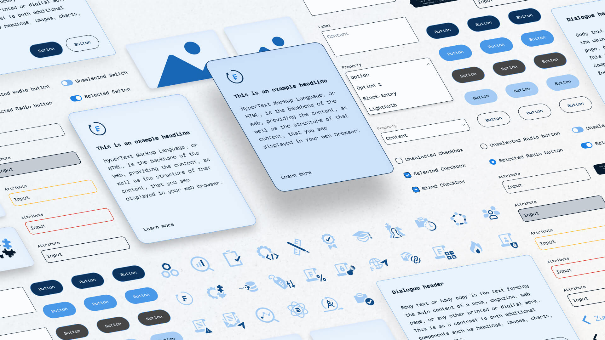
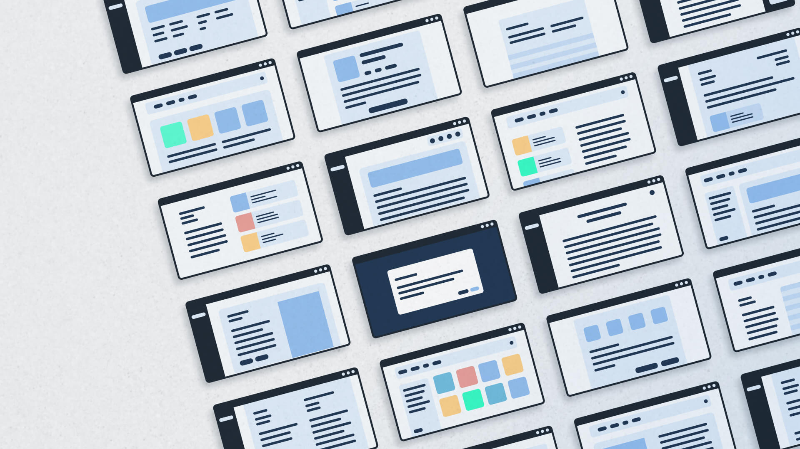

## About WinCredit

BaseNet Informatik offers WinCredit, a B2B credit software solution, for over
two decades. It provides an overview of credit initiation, administration, and
associated securities for individuals and legal entities.

The application, with over 20 years of use, had an outdated UI and required
updates to support cloud migration. Along with the need for improved usability
and feature enhancements, integrating UX played a key role in refining the
user experience and ensuring long-term success.

## Challenges and contribution

The project began with a technical proof of concept for *WinCredit 3* and will
evolve over the next few years, gradually introducing new features. A major
focus is on refreshing the UI library and design system, which were integrated
within the frontend framework, Bootstrap 5. The goal is to modernize the
entire software architecture while ensuring that it meets current usability
standards.

From a UX perspective, the main objective was to enhance user workflows by
minimizing sources of error and creating a more intuitive, user-friendly
interface that aligns with modern usability practices.

My contributions are summarised in two key areas:

- Component library migration and establishing a design system
- Redesign and UX patterns for the new software generation

## Component library migration and establishing a design system

The project involved migrating the component library from Adobe XD to Figma,
creating a scalable and efficient design system used across multiple products.
This transition improved collaboration and highlighted the need for ongoing
design system management despite challenges with balancing maintenance and
deliverable deadlines.

→ Read more in the sub-case: [Migrating the Component Library from Adobe XD to Figma](/projects/wincredit-design-system)

## Redesign and UX patterns for the new software generation

I worked with a cross-functional team to redesign core features and establish
UX patterns for the new version of WinCredit. My responsibilities included
creating high-fidelity screens, mapping user journeys, and collaborating with
developers to ensure feasibility.

The main challenge was balancing flexibility with consistency, which we
addressed through guided workflows and feedback loops. The outcome was a
streamlined, user-centered design that improved both functionality and
adaptability for future growth.

→ Read more in the sub-case: [Redesign and UX patterns for the new software generation](/projects/wincredit-ux-patterns)

## Outcome

My contributions to this project led to improvements in both the design system
and the overall user experience. We streamlined collaboration processes,
enhanced the scalability of the design system, and redesigned core features to
optimize workflows.

## Lessons learned

Migrating to Figma was essential for future-proofing the design system, though
it underscored the need for a dedicated role to maintain component libraries.
The project highlighted the importance of balancing library upkeep with tight
deadlines, emphasizing that a design system is a living document. My key
takeaway was the need for pragmatism in UX design, balancing ideal solutions
with real-world constraints to create a scalable and adaptable product.

## Shoutout

I want to thank Rafael Adame and Sonja Frey for the opportunity to work on
this project. Their high-level UX design approach was impressive and something
I aim to apply in future projects. Lastly, I appreciate the product team,
especially Damian Hofmann, for their technical explanations on the context.
