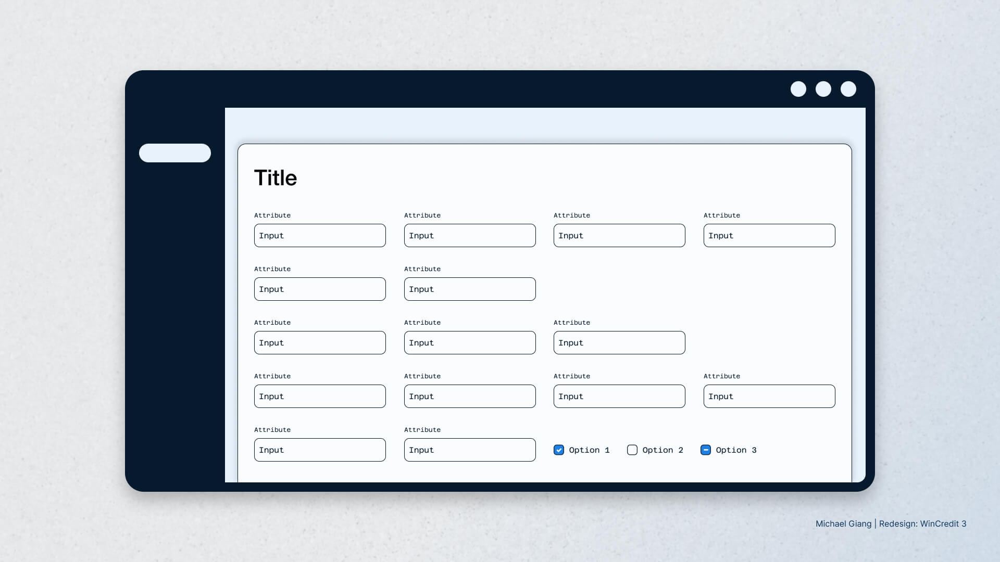
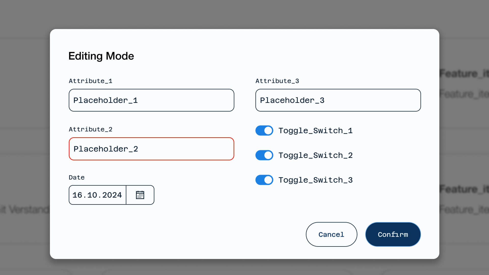
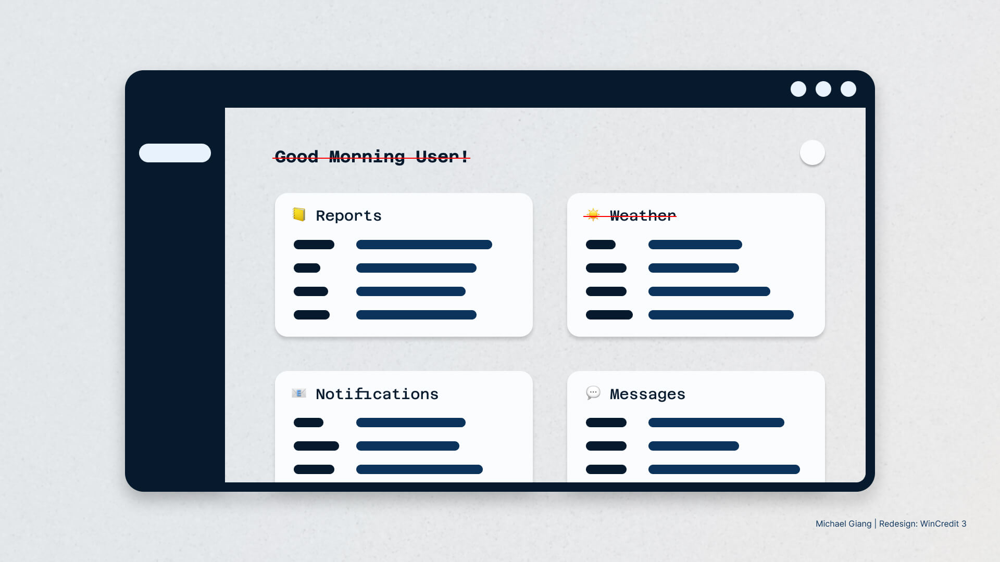
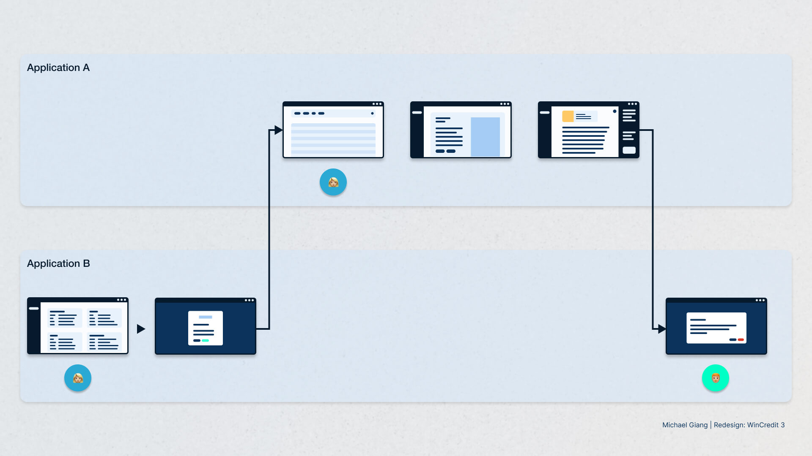
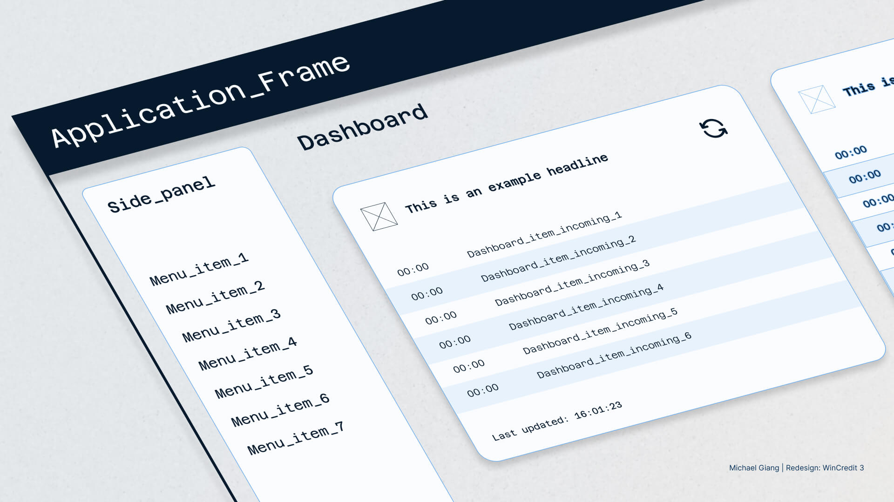
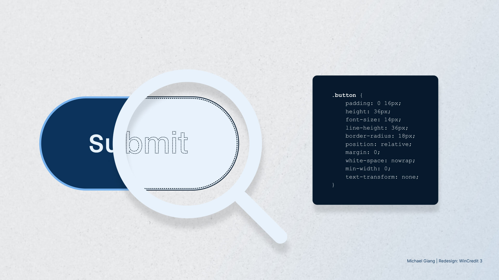

## Overview

BaseNet Informatik offers WinCredit, a B2B credit software solution, for over
two decades: an overview of credit initiation, administration, and associated
securities for individuals and legal entities. After more than 20 years in
use, the application had an outdated UI and required updates to support cloud
migration — with *WinCredit 3*, usability became a key part of the new
software generation.

As part of a cross-functional team that included business analysts, product
owners, developers, and designers, I contributed to redesigning core features
and establishing UX patterns for the new version of WinCredit. My
responsibilities spanned from the initial setup of the design system to
working as a product designer in an agile environment. Together with the team,
we defined requirements and mapped user flows. I created high-fidelity screens
that visualized new concepts, helping us gather feedback and align on the
development process.

## Problem statement

The main task was to redesign the core features from the predecessor. These
features were unrestrictive, allowing users to add or remove information
freely, often without understanding the consequences. Additionally, the B2B
software had extensive client-side customization, as businesses had different
processes on the same topic. This flexibility, while valuable, led to
inconsistencies and confusion among users and stakeholders maintaining the
software.

*Input masks were unrestrictive, which led to inconsistencies and confusion among users*

## My responsibilities

- Redesign core features to improve usability
- Collaborate with business analysts and developers to ensure feasibility
- Conduct user journey mapping to simplify complex processes
- Facilitate feedback loops between UX and developers
- Hold brown-bag sessions to train stakeholders on design principles

## Redesign core functionalities to improve usability

The flexibility of the legacy software often led to errors and required very
specific inputs. Our goal was therefore to create guiding workflows without
compromising flexibility.

We redesigned input methods based on data gathered from WinCredit 2 to guide
users through a modal-based editing mode. This allowed us to cater to
different business processes while maintaining consistency across the
platform. By implementing this way of guidance, we also ensured that users
were aware of the impact of their actions. This redesign not only simplified
the core functionality, but also maintained the customizability required for
different clients, such as the complexity of a notepad field.

*Modal-based editing masks ensured that users were aware of the impact of their actions*

## Dashboard development

Another main task involved the development of a dashboard. Initially, the
requirements contained a wide range of features that, from a UX perspective,
cluttered the workflow.

Dashboards are often promoted as essential tools to clients, but following
[Taras Bakusevych](https://uxplanet.org/10-rules-for-better-dashboard-design-ef68189d734c),
the development should be done later in the process to avoid feature bloat.
However, from a business perspective, they are often highly sellable.

Within this context, we challenged the value of the dashboard. Through client
feedback and the notion of UI density by
[Matthew Ström](https://matthewstrom.com/writing/ui-density/), we streamlined
the interface by removing redundant features, focusing on key functionalities
that aligned with user needs according to the information density and time to
fulfil the task, and making the dashboard a vital pivot point in the user
journey.

*From a UX lens, we challenged the value of some features in the dashboard*

## User journey map and complexity reduction

One feature involved the use case of extending the conditions of a credit
contract. These cases had numerous dependencies, and in most instances, the
data couldn't be mutated during the fixed term. My role in this process was to
map out all conditions involved, providing an overview across multiple systems
and applications.

This journey includes several business applications, required data from
different databases, and involved various user roles (such as final
verification). I collaborated with business analysts to create a visual map
that compressed the entire workflow into a coherent structure. It questioned
several processes, dialogues and inputs that were initially thoughtful but
turned out to be unnecessarily complex. Additionally, it acted as a foundation
for refining workflows and ensuring alignment across the project, improving
the overall efficiency of the process.

*The user journey map compressed the entire use case to question elements in the requirement list*

## Collaboration with development team

I worked closely with the development team to ensure that design concepts were
technically feasible. The front-end architecture was based on Angular. An
example of this collaboration occurred during the dashboard development, where
issues arose with syncing data automatically from multiple databases. From a
UX perspective, we offered solutions focusing on transparency. We introduced
concepts of progress feedback (such as a "last updated" timestamp), or a
manual refresh option with status indicators to give users control within the
technical constraints.

These challenges were addressed through open communication with the
development team, ensuring both the technical and usability aspects were
optimized.

*Data-sync issues were addressed by methods like timestamps and a manual refresh*

## Challenges faced

The main challenge we faced was gaining traction in a newly established,
multidisciplinary team. As a UX team, we suggested improvements to ensure
alignment with development goals such as reviewing HTML/CSS code architecture
to ensure the maintenance of the components.

Another challenge was that some initial features were conceptualized without
fully considering the technical limitations, which became tangible during the
design phase. To address this, we established early feedback loops with the
development team to discuss technical feasibility early in the process. This
proactive approach helped prevent issues and reduced friction as the project
progressed.

*As UX team, we supported the development team with component construction*

## Outcome

In the end, our team successfully streamlined the collaboration process,
improving it with each sprint. Our redesigns of the dashboard and core
features adhered to the principle of UI density, guiding users through the
workflow with clear interaction patterns and less visual clutter.

## Lessons learned

My takeaway from this project reinforced the importance of pragmatism in UX
design, balancing ideal design solutions with real-world constraints like
technology, user needs, and business goals. The success of our work wasn't
just about making the software visually appealing. It was about making it
usable, scalable, and adaptable for future growth. Through close
collaboration, user-centric design, and technical feasibility, we delivered a
product that was both functional and future-proof.

## Shoutout

I want to thank Rafael Adame and Sonja Frey for the opportunity to work on
this project. Their high-level UX design approach was impressive and something
I aim to apply in future projects. Lastly, I appreciate the product team,
especially Damian Hofmann, for their technical explanations on the context.
